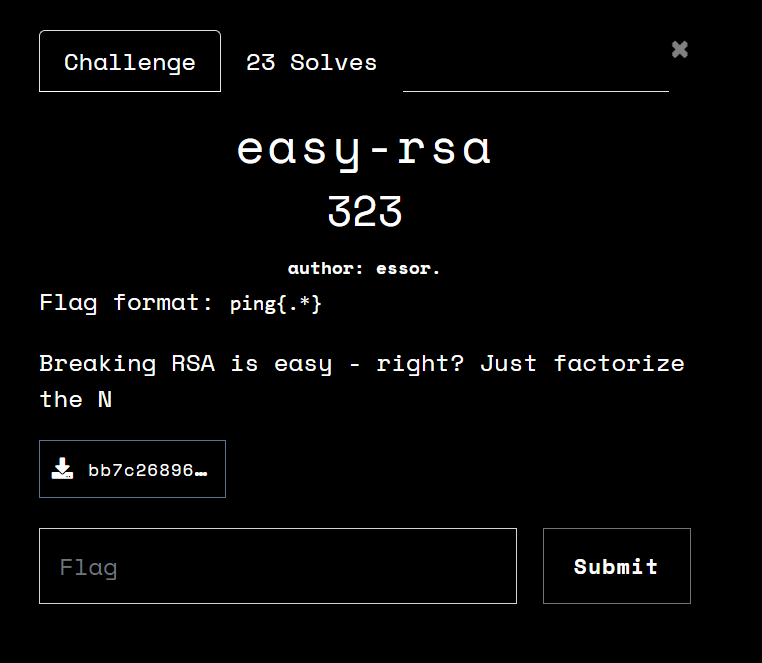

# Crypto: easy-rsa
solver: [N0am!ster](https://github.com/N04M1st3r)  
writeup-writer: [N0am!ster](https://github.com/N04M1st3r)
___
**Author:** essor  
**Description:** 
> Breaking RSA is easy - right? Just factorize the N

**files (copy):** [out.txt](files/out.txt) [main.py](files/main.py)



The challenge was a crypto RSA challenge, where you had some info about p and q, and you need to decipher the encrypted msg.

## Challenge Overview
Firstly we generate p, q as 2048 bit primes, calculate n and set e=65537.
Then we encrypt flag with regular plain RSA,
we know:
1) help1 = q&p
2) help2 = q&(p<<1)
3) n
4) e
5) ct (encrypted flag)

## Solution
In this writeup I will talk about the bits.
when I write help1[i] I mean the ith ith of help1.
and when I write help2[i] I mean the ith bit of help2.
same for p[i] and q[i].
In my final solution I put it all in a list so it would be easy to access in an array like structure, but you can do it like so `help1&(2**i)>>i` or like so `help1&(2**i)!=0`(where true=1, false=0).
The smallest i is 0, and the largest is 2047.

### Part 1  - q&p
Firstly lets look at help1(q&p), and from looking at the table of what input gives what output we can conclude that it gives 1 only when p and q are both 1.
`help1[i] = q[i]&p[i]`
So we know that if the help1[i] is 1, then p[i]=1 and q[i]=1.
| p&q| q | p |
|  --| --| --|
| 0  | 0 | 0 |
| 0  | 0 | 1 |
| 0  | 1 | 0 |
| **1**  | **1** | **1** |

Code:
```python
for i, bit in enumerate(help1):
	if bit == '1':
		p[i] = '1'
		q[i] = '1'
```

### Part 2 -  q&(p<<1)
First of all, lets convert it to indexs: `help2[i] = q[i] & p[i-1]`.
now like part1, we know that if help2[i] is 1 then q[i] and p[i-1] are both 1.

Code:
```python
for i, bit in enumerate(help2):
	if bit == '1':
		p[i-1] = '1'
		q[i]   = '1'
```

### Part 3 - Combining information
We can get even more information because of these equations.

#### Part 3.1 - getting information from help1
lets look at what happens when `help1[i] = 0` (that means that q[i]=0 or p[i]=0 (or both)):
 - lets assume we know **`q[i] = 1`**:
 
   -  then (`1 & ? = 0`) p[i] must be 0!
 - lets assume we know **`p[i] = 1`**:
   - then (`? & 1 = 0`) q[i] must be 0!
 - lets assume we know `q[i] = 0`:
   - then (`0 & ? = 0`) we know nothing about p[i] from this.
 - lets assume we know `p[i] = 0`:
   - then (`? & 0 = 0`) we know nothing about q[i] from this.
 
so we know:
1. `help1[i] = 0 and q[i] = 1` => `p[i] = 0`.
2. `help1[i] = 0 and p[i] = 1` => `q[i] = 0`.

Code:
```python
for i, bit in enumerate(help1):
	if bit == '1':
		continue
	
	if q[i] == '1':
		p[i] = '0'
	elif p[i] == '1':
		q[i] = '0'
```

#### Part 3.2 - getting information from help2
lets look at what happens when `help2[i] = 0` (that means that q[i]=0 or p[i-1]=0 (or both are 0)):
reminder: `help2[i] = q[i] & p[i-1]` => `q[i]&p[i-1] = 0`.

-	lets assume we know `q[i] = 1`:
    -	then (`1 & ? = 0`) p[i-1] must be 0!
    
-	lets assume we know `p[i-1] = 1`:
    - then (`? & 1 = 0`) q[i] must be 0!
 - lets assume we know `q[i] = 0`:
   -  then (`0 & ? = 0`) we know nothing about p[i-1] from this.
 - lets assume we know `p[i-1] = 0`:
   -  then (`? & 0 = 0`) we know nothing about q[i] from this.
 
 so we know:
1. `help2[i] = 0 and q[i] = 1`     => `p[i-1] = 0`.
2. `help2[i] = 0 and p[i-1] = 1` => `q[i]   = 0`.


Code:
```python
for i, bit in enumerate(help2):
    #skiping bits that are 1, and i=0 because p[i-1] will be p[-1].
	if bit == '1' and i == 0:
		continue
	
	if q[i] == '1':
		p[i-1] = '0'
	elif p[i-1] == '1':
		q[i]   = '0'
```


so from knowing this we can now write a code that extracts a lot of bits from p and q, but not all of them.
### Part 4 - Finding the rest of p and q
Now we have part of p and part of q, or more precislly we have random known bits of p and random bits of q, after some searching on the internet I stumbled upon this article `Recovring cryptographic keys from partial information, by example`
which had one very important subtitle for this challenge, [`Random known bits of p and q`](https://eprint.iacr.org/2020/1506.pdf#page=23).
I used the method described in the article to get p and q.
Now I am going to try and explain the method, but it was explained very good in the article so I encourge you to go and read it from there. (and for those who understood it, just skip to part 4)

*for those not fluent in python, note that I will write % instead of mod, and use \*\* for power.
*I will use p[:i] and q[:i], that means all the bits until the ith bit. (I am including the 0th bit, and not including the ith bit)

(note that here we start this iteration at i=1, and not i=0)
The method explained in the article is basiclly to guess p and q bit by bit, and for each bit to check if it is correct by multiplying p and q mod 2**i, and at the end to check if p*q=n. (and if they are prime)
it works because:
- `p*q % (2**i) = (p % 2**i) * (q % 2**i) % (2**i)`
==>
- `N % (2**i) = p[:i] * q[:i] % (2**i)`
(btw it is faster doing it using `& (2**i - 1)` instead of modulo, but I will stick to what the article said for simplicity )

lets say we have an integer N=p*q,
we know `p=0b??01?` and `q=0b1?001`, `N=493`
we start at the 0th bit, where i=1, we have ? and 1:
1. attempting p[0]=0:  `0*1 % (2**1) = 493 % (2**1)` => `0 = 1` X
2. attempting p[0]=1:  `1*1 % (2**1) = 493 % (2**1)` => `1 = 1` V
	1. i=2, already written, `0b01*0b01 % (2**2) = 493 % (2**2)` => `1 = 1` V
		1. i=3, p[2]=0: `0b001*0b001 % (2**3) = 493 % (2**3)` => `1 = 5` X  
		2. i=3, p[2]=1: `0b101*0b001 % (2**3) = 493 % (2**3)` => `5 = 5` V
			1. i=4, p[3]=0 q[3]=0: `0b0101*0b0001 % (2**4) = 493 % (2**4)` => `5 = 13` X 
			2. i=4, p[3]=0 q[3]=1: `0b0101*0b1001 % (2**4) = 493 % (2**4)` => `13 = 13` V 
				1. i=5, p[4]=0: `0b00101*0b11001 % (2**5) = 493 % (2**5)` => `29 = 13` X 
				2. i=5, p[4]=1: `0b10101*0b11001 % (2**5) = 493 % (2**5)` => `13 = 13` V
					That means that maybe => `p=0b10101=21` and `q=0b11001=25`
					so for the final check, `21*25= 493` => `525 = 493` X
			3. i=4, p[3]=1 q[3]=0: `0b1101*0b0001 % (2**4) = 493 % (2**4)` => `13 = 13` V
				1. i=5, p[4]=0: `0b01101*0b10001 % (2**5) = 493 % (2**5)` => `29 = 13` X
				2. i=5, p[4]=1: `0b11101*0b10001 % (2**5) = 493 % (2**5)` => `13 = 13` V
					That means that maybe => `p=0b11101=29` and `q=0b10001=17`
					so for the final check, `29*17 = 493` => `493=493` V
			4. i=4, p[3]=1 q[3]=1: `0b1101*0b1001 % (2**4) = 493 % (2**4)` => `5 = 13` X 

so we found p=29 and q=17, but as you can see this method will take much longer as we have more and more paths that split up, and as you can see from tring to run this method, it will take too much time, so we have to make it better and so, part 5.

note that in the code I will start at 1, because the 0th bit is always 1 and because of an upgrade I will do later to the code.
Code:
```python
def solvePQ(p: list, q: list):
	p[0] = '1'
	q[0] = '1'

	#because they are prime, they have to not be divisible by 2.
	solvePQ_R(p, q, 0)


def solvePQ_R(p: list, q: list, index: int):
	'''
	We know p[:index+1] and q[:index+1]
	and we need to find out p[index+1] and q[index+1]
	'''

	#We can make it a little faster by not doing this each time, and just doing some bit operations, and passing p_num as a parameter.
	p_num = int(''.join(p[:index+1][::-1]), 2)
	q_num = int(''.join(q[:index+1][::-1]), 2)

	mod = 2**(index+1)
	#can also do with & (mod-1)
	if (q_num*p_num) % mod != n % mod:
		return

	if index+1 == len(p):
		if q_num*p_num != n:
			return
		print("SOLVED")
		print(f'{p_num=}')
		print(f'{q_num=}')
		return

	if p[index+1] == '?' and q[index+1] == '?':
		for bit1 in ['1', '0']:
			for bit2 in ['1', '0']:
				p[index+1] = bit1
				q[index+1] = bit2
				solvePQ_R(p, q, index+1)
		p[index+1] = '?'
		q[index+1] = '?'
	elif p[index+1] == '?':
		for bit in ['1', '0']:
			p[index+1] = bit
			solvePQ_R(p, q, index+1)
		p[index+1] = '?'
	elif q[index+1] == '?':
		for bit in ['1', '0']:
			q[index+1] = bit
			solvePQ_R(p, q, index+1)
		q[index+1] = '?'
	else:
		solvePQ_R(p, q, index+1)
```

also in start you may want to change the recursion limit. (or write the function without recursion)
```python
import sys

sys.setrecursionlimit(3000)
```

### Part 5 - optimizing the search for p and q
Now after part 4 you probably think what now, we have p and q.
and this would have worked if the bit length was smaller but it is 2048 which is too much for the previous method alone
but actually it still takes too long, so we will need to optimize part 4.

#### Part 5.1 - Adding the check for q&(p-1) and for p&q
Every time we add a new bit to p or q, we need to check `q[i]&(p[i-1]) == help2[i]` and if it is not correct delete it. same for `q[i]&p[i] == help1[i]`
```python
q_cur = int(q[index], 2)
	p_cur = int(p[index], 2)

	if q_cur & p_cur != int(help1[index], 2):
		return

	#Can make it faster by a few if's by assuming index >= 1, and just changing solvePQ. 
	if index > 0:
		p_prev = int(p[index-1], 2)
		if q_cur & p_prev != int(help2[index], 2):
			return
```

now the code will be fast enough but I want to make just a little improvment:
in the case of `p[index+1]=='?' and q[index+1] == '?'` I don't really need to run over all the options, because it cant be that both of them are 1, because then I would have known so I can improve it like so:
```python
	if p[index+1] == '?' and q[index+1] == '?':
		for bit1 in ['1', '0']:
			for bit2 in ['1', '0']:
				if bit1=='1' and bit2=='1':
					continue
				
				p[index+1] = bit1
				q[index+1] = bit2
				solvePQ_R(p, q, index+1)
		p[index+1] = '?'
		q[index+1] = '?'
```
*The code can be made even better but it runs in less than a second so I stoped here

### Part 6 - Cracking rsa, when knowing p and q

now we run the code and got p and q.
then all we need to do is decrypt them, this is easily done 
```python
p_num = 200...151
q_num = 314...087
phi = (p_num-1)*(q_num-1)
d = inverse(e, phi)
m = pow(ct, d, n)
flag = long_to_bytes(m).decode()
print(flag)
```

flag: **ping{RSA_p_and_q_for_the_win!}***

[solve.py](solve.py)
